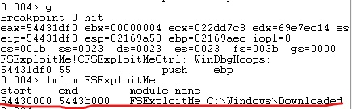
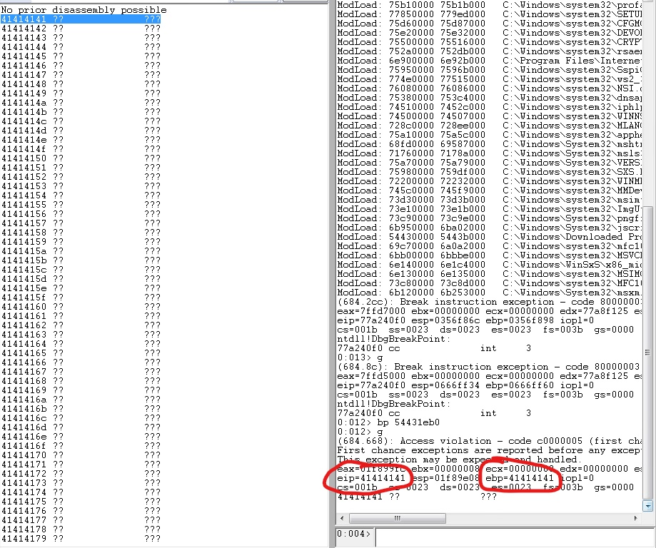
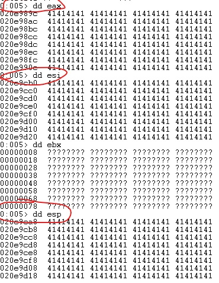
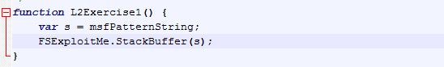
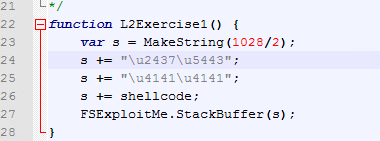
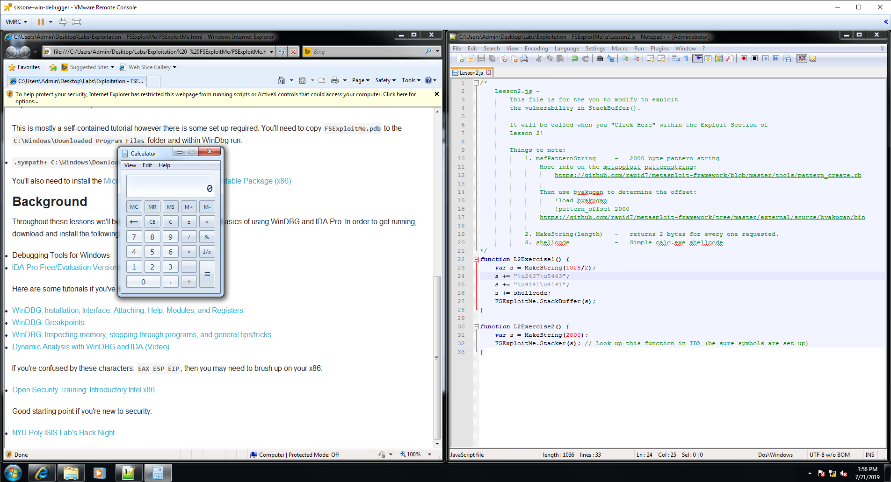

## Week 4 Write Up
### Introduction
The learning material in week 4 shows how to think like a malware creator by finding vulnerabilities/exploits in software and taking advantage of them.

### Manipulating Software
There are two kinds of vulnerabilities in software.  The first is bugs found in a system that can allow someone unauthorized access to it or change the behavior of the program entirely.  The example in the lecture demonstrated this concept with an example program.  The program showed a car on a road, and that car eventually hits a fork in the row.  The program then prompts the user asking which direction they should go.  While the program is intended to take the answers "left" or "right", putting in a different answer like "straight" can alter the program behavior and create a scenario that was unintended by the creator.

The second vulnerability is a misconfiguration or a result of poor programming practice.  These are vulnerabilities that are not from the direct source code of a program. For example, weak passwords and accounts with no security measures are weak points that hackers can use to get into a system.

### Hacking Over Time
Hacking and manipulating software has changed drastically over time.  While they started out as jokes and forms of self-expression, they have gotten more serious as people use them for more malicious purposes.  Countries have their own teams of experts participating in cyber warfare, and even companies are looking to prevent hacking by promoting bug bounty programs (companies will pay people money if they find vulnerabilities in their system).

With this serious shift, hackers' targets for attacks have also shifted.  Many attacks started on the perimeter systems (company websites, email servers, etc.).  However, companies and governments have fortified their perimeter systems which ends up forcing hackers to look elsewhere.  Now hackers look to attack internal networks by attacking users directly through phishing, social engineering, and other methods.

### WinDbg
WinDbg is a standard debugger program that freezes a program for inspection.  Below are a list of useful commands.
- lm: Lists modules
- lmf: Finds all modules with specified string (lmf m simple*)
- bp: Sets a breakpoint
- bl: Lists breakpoints
- g: Go, executes a program until a breakpoint is reached
- dd: Displays a dword of memory
- db: Views actual bytes of memory
- da: Displays memory in ASCII strings
- du: Displays memory in Unicode
- u: Unassemble, takes bytes at given address and starts to process them as assembly
- .formats: Can help convert hex to decimal
- t: Takes a step into next step
- p: Take a step over
- pt: Step over an entire function
- q: Quit

### Lab Lesson 1
The first lesson of the lab is a basic overview on how to use WinDbg and how to explore executables with it.  For example, you can find the address of a module using lmf m.

Another thing that the lesson goes over is how registries work.  Registries hold small amounts of internal data that helps the system keep track of where it is.  It can hold variables like counters, return values of functions, and pointers.  Having these variables stored in registries improves performance since the system doesn't have to look through memory to find these variables.

### Lab Lesson 2
Lesson 2 goes over stack behaivor and how to exploit it.  It also goes over how attacks can be found targeting registries.  Below you can see attacks on the eip and ebp registries.  Below that are pointers that point to targeted registries.

### Lab Lesson 3
Lesson 3 goes over how the heap can be manipulated much like the stack can in Lesson 3.

### Conclusion
Ultimately the lab shows how to execute code through vulnerabilities on a system.  In the case of the lesson, the goal was to run a calculator application.  To do this, there are 4 steps that we follow.  The first is to understand the crash triage, or understand the state of a crash.  We have to figure out whether we are overwriting data directly into registries or using pointers, if we are using data on the stack or the heap, and where we are in execution when the program crashes.  After that, we need to determine the address offset.  This is figuring out the offset of the EIP registry (the pointer) so that we can overwrite with something of our own.  In the second lesson we used msfPatternString which is a non-repeating pattern string, and byakugan to find the offset.

The third step is to position our shellcode.  With NOP Sled operations, we can add our shellcode and a return address to the stack.  The final step is to find the address of our shellcode in memory.  To do this we find a module loaded at a static address, and then find the jmp esp operation within that memory space.  We can find this operation that shouldn't exist by looking 2 bytes into normal instructions and processing that part of the instruction separately.  Where ever that jmp esp instruction jumps to is where we can safely input our shellcode.  However, 414141 needs to be inserted between the jmp esp address and the shellcode.  Below is the JavaScript code that opens the calculator.

