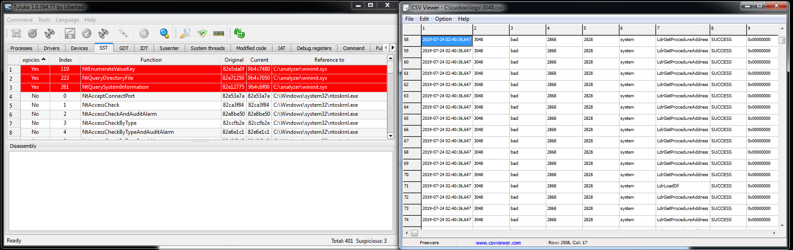
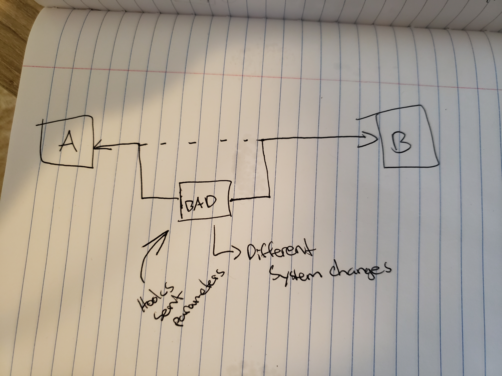

## Week 5 Write Up

### Rootkits
Rootkits aretools that help malware actively conceals its existence and actions from users and system processes.  Rootkits tend to embed itself into the kernel memory of a system.  However, rootkits have a difficult time entering 64 bit kernel systems and need to use alternate methods.  These methods are listed below.
* Bypassing driver signing check (e.g. using testsigning mode)
* Modifying the windows boot path (MBR etc) - Secure boot prevents this.
* Kernel exploits in Windows kernel or third party drivers
* Stealing valid digisigs (similar to Stuxnet)

### Kernel
The kernel is the central module of an operating system.  It is the first to be loaded and remains in main memory of a system.  The kernel is responsible for memory management, task management, process management, and disk management.  The kernel is a prime target for rootkits because rootkits take advantage of the fact that operating systems control permissions to give the rootkit code high level privileges.  This allows rootkits to avoid detection from antivirus software.

### Threads
Threads are the smallest unit of execution within an operating system.  They are component of processes, typically they are the code and data parts of processes, and can be managed independently througha thread scheduler.  Thread schedulers executes all threads at a certain priority level one at a time.  Most applications are multi-threaded, meaning that multiple threads can exist in one process and execute concurrently.  CPUs can pipeline multiple threads one at a time, but now there is multi-core processing allowing a single CPU with multiple cores that each pipeline a thread.

### Process Memory
Processes are sets of instructions being executed by the computer CPU, and the CPU's memory comes in the form of registers.  Processes are implemented as objects and can contain one or more threads, but the process needs at least one thread to execute.  Processes also include an object table that has handles to other objects known to this process.

### Agony Lab
The Agony lab demonstrates an example on how rootkits work.  Using Cuckoo and Tuluka, we find a suspicious file called winit.sys.  It is performig three different functions, NTEnumerateValueKey, NTQueryDirectoryFile, and NTQuerySystemInformation.  NTQueryDirectoryFile is a function that create a directory and enumerate it, NTEnumerateValueKey helps enumerate registry values, and NTQuerySystemInformation gives infromation about a system allowing for easier enumeration of a process.  These three functions are contributing to the rootkit hooking the parameters being passed to the kernel.

Hooking is the process of intercepting fuction calls and altering them.  The rootkit is are using the NTQueryDirectoryFile to hide the file with the malware in it (winit.sys), NTEnumerateValueKey to hides the registries that are being created by the malware, and NTQuerySystemInfromation to hide the processesm in Process Explorer or Task Scheduler.

Below is the offset found through WinDbg.
