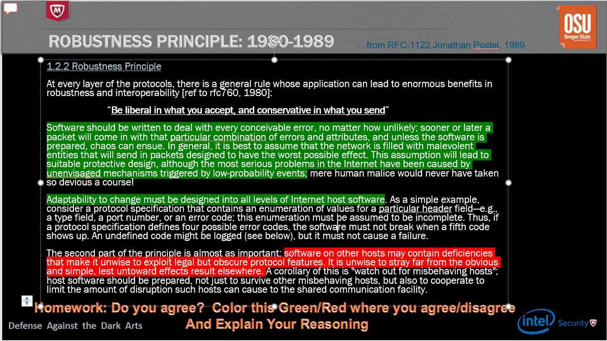
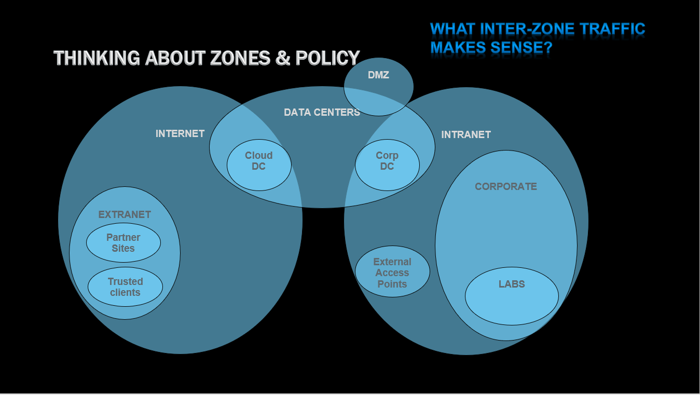
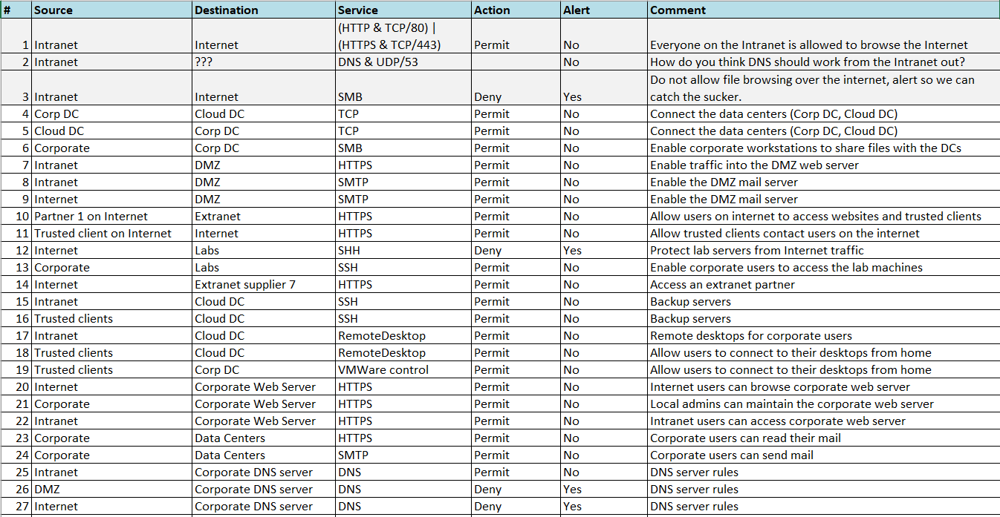
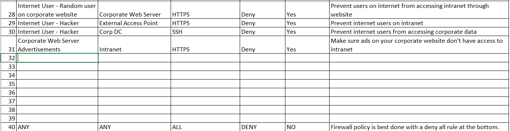
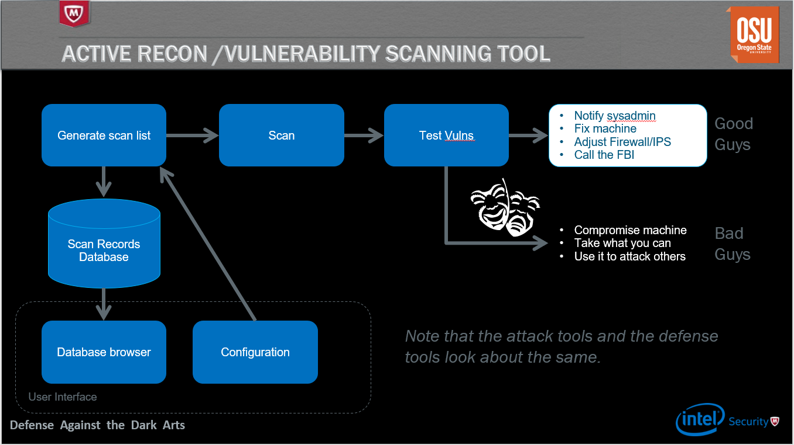

## Week 6 Write Up

### Network Security
Network security is the prevention of unauthorized intrusions into a network.  These security measures can be host based, in the network, or even out on a network.  

### Robustness Principle
Below is the Robustness Principle with what I agree with highlighted in green and what I disagree with in red.

I agree with most of the first principle.  I think it is ideal to have a host that is prepared for any situation, especially rarer forms of attack on a network.  Being prepared for everything, including the worst, will lead to more security measures and a more secure network.  However, it is impossible to think of every possible attack.  It may be difficult to cover every gap in your defense and that is why I partly disagree with the second statement.  The principle states that you should avoid looking for weaknesses in other networks to prevent chaos, but I believe its important to also point these weaknesses out.  If others are actively look for weaknesses, they can notify a network before someone with malicious intent finds it before them.  While network users shouldn't be purposely looking for faults in network security, I don't think they should turn a blind eye to one when they see one.

### Network-Based Protection Strategies
Below are list of common network protections strategies.

* Positive Policy (Whitelisting)
  * Only allow what you expect to happen
  * Do not permit suspicious things
  * Fundamental concept that allows for defender advantage and limited attack surface

* FireWalls and Security Zones
  * Sits in zones in a network
  * Filters traffic between zones
  * Best at describing policy from IP to IP address.
  * 
  * 
  * 
  
* Defense in Depth
  * Assume outside defenses will fail, have stronger defense measures as you get farther in
  
* Intrusion Detection
  * Use signature/anomaly detection to detect intrusions
  * Catches known attacks quickly and gets good information on attackers
  * Will have zero day attacks and false positives
 
* Honeynets/Intrusion Deception
  * Create phony network and content to waste attacker time
  * Requires a lot of configuration per site

* Quarantine
  * Place misbehaving hosts into quarantine areas where they can't hurt anyone
  * Commonly used on network entry, equp firewalls with "blacklisting" function

* Reputation
  * Collect a list of bad and good data, serve the list out from a cloud
  
 * Spoofing
   * Attackers masquerades as another network entity in order to gain some kind of advantage over the network dfenses of the target
  
### Man in the Middle
The man in the middle is a concept within network security.  It is the idea that a person can intercept signals and messages between two parties.  The man in the middle can use this interception for good and bad deeds.  Below is a list of common actions a man in the middle can do.

* ARP Poisoning
  * Flood network with ARP responses
 
* TCP Hijacking
  * Inject, Delete, or change data into a TCP stream
  * Fix packets so that no one notices that there were alterations
 
* Terminating TCP Proxy
  * Terminate TCP connections on one side, create a completely new connection on the other side
  * Rewrite all headers so that an attacker can't transmit protocol attacks through the firewall.  Repackage TCP packets to make efficient use of the packet size, remove overlapping segments, retransmissions
 
* HTTP Proxy
  * intercept HTTP traffic
  * Verify destination against list of dangerous hosts
  * Look for stangely encoded URLs that users normally won't use
  * Detect and remove malicious Javascript or EXE file from the remote sites from response
 
* Mail Proxy
  * Prevents attackers from sending EXE files
  * Looks for sensitive data being exfiltrated in emails
 
* SSL MITM
  * Intercept SSL, decrypt and re-encrypt
  * In front of a server, by sharing the private key
  * Use DNS MITM to fool the client into believing the certificate is valid
 
## Reconnaissance
Reconnaissance is done by attackers to obtain information on their targets.  For example, attackers need to find the address of a service before they can attack it.  There are two kinds of reconnaissance, active and passive.  Active reconnaissance is getting information that will help directly attack a target.  Most active reconnaissance come in the form of scanning tools that try to connect to hosts and services, allowing attackers to find vulnerabilities within a system.  

Passive reconnaissance is obtaining information that won't directly hurt a system or alert the system to the attacker presence.  This is generally just data collecting by an attacker.  This is done through tapping into ISPs, hiding equipment in wiring closets, or listening to radio signals.

There are several ways to defend against reconnaissance.  Both policy and deep inspection helps, and honeynets can slow down reconnaissance.  
