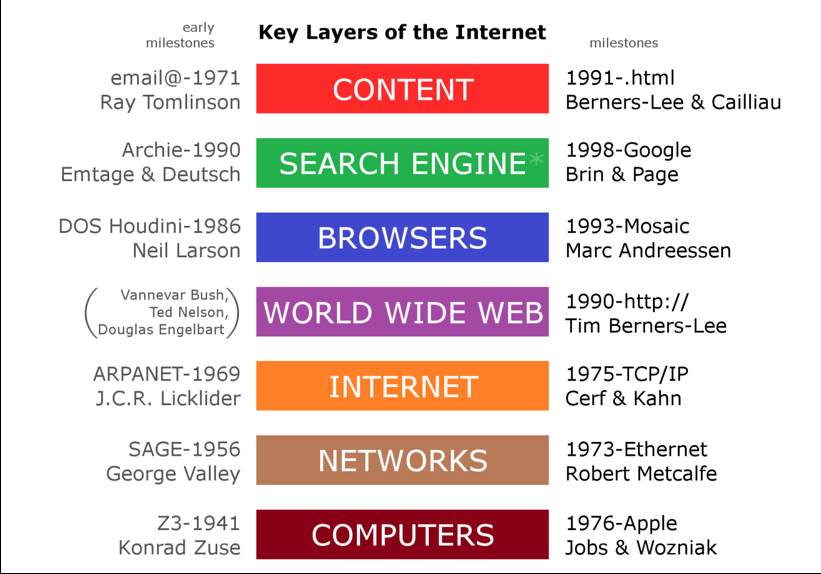
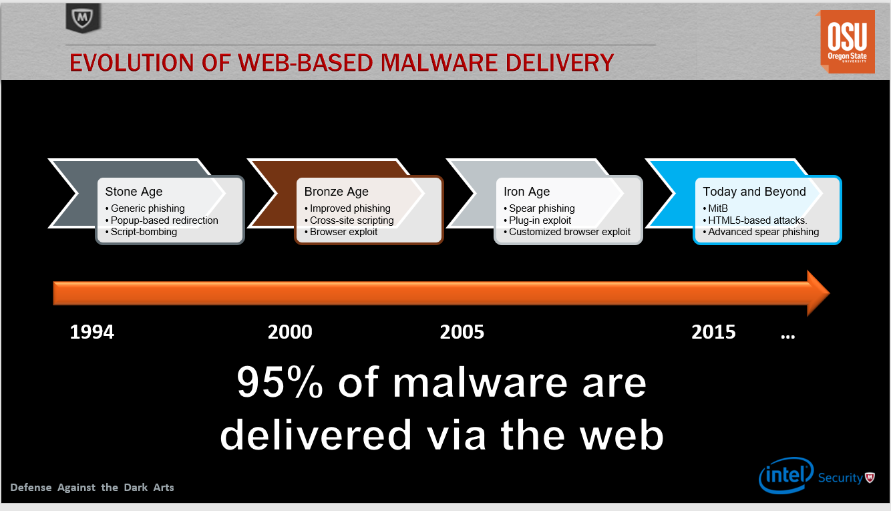
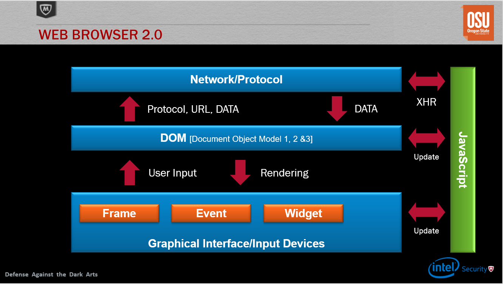

## Week 7 Write Up

### The Web
The World Wide Web is an information system on the internet that allows many devices connected to it to interact with each other.  HTTP is th foundation of data communication for the Web.  The Web is a recent phenomenon that has evolved quickly over the years. For example, the first web browser shown below was developed in 1993. 

Below here is a map showing all the revelant advancements that have come out after the computer in 1976.

Because of the rapid advancements of the Web, Web-based malware has also changed with it.  Malware delivery strategies began as generic phishing, popup-based redirection, and script-bombing.  The phishing and popups were easy to distinguish as malware since they had obvious signs.  Phishing links would redirect you to clearly copy and pasted sites but with spelling errors and popups were not discrete.  Script-bombing were annoying tools that would kill your computer temporarily, but not destroy any data on the targeted computer.

During the 2000s, people came up with new ideas such as cross-site scripting, browser exploits, and improved phishing techniques.  However, most of these were ideas that couldn't be implemented with the current tools available.  Later, phishing techniques improved and plug-in exploits were introduced.  Plug-in exploits were exploits written in third-party plug-ins that were shared between all web browsers.  Otherwise, people had to write customized exploits for each browser.  Today, attacks come through advanced spear phishing, HTML5-based attacks, and MitB.  Most attackers have found that as long as a computer stays on, they can initiate most of their attacks from the web browser.  Before, the goal was to implant malware from the browser onto the operating system and start attacks from there.

Web browsers work in layers:
* Network/Protocol: Layers that connects to the rest of the world, whether through the internet or other means
* DOM: Where all the processing done by the web browser is done
* Graphical Interface/Input Devices: Where the user interface, input devices, such as keyboards and mouse, and anything else that interacts with the user is
* Javascript: Versatile layer that can interact with any other layer in several ways

Injection points are 
