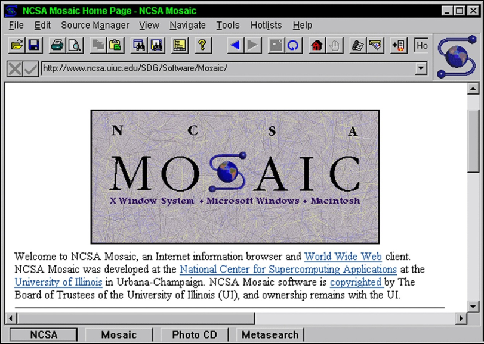

## Week 7 Write Up

### The Web
The World Wide Web is an information system on the internet that allows many devices connected to it to interact with each other.  HTTP is th foundation of data communication for the Web.  The Web is a recent phenomenon that has evolved quickly over the years. For example, the first web browser shown below was developed in 1993. 

Below here is a map showing all the revelant advancements that have come out after the computer in 1976.

Because of the rapid advancements of the Web, Web-based malware has also changed with it.  Malware delivery strategies began as generic phishing, popup-based redirection, and script-bombing.  The phishing and popups were easy to distinguish as malware since they had obvious signs.  Phishing links would redirect you to clearly copy and pasted sites but with spelling errors and popups were not discrete.  Script-bombing were annoying tools that would kill your computer temporarily, but not destroy any data on the targeted computer.

During the 2000s, people came up with new ideas such as cross-site scripting, browser exploits, and improved phishing techniques.  However, most of these were ideas that couldn't be implemented with the current tools available.  Later, phishing techniques improved and plug-in exploits were introduced.  Plug-in exploits were exploits written in third-party plug-ins that were shared between all web browsers.  Otherwise, people had to write customized exploits for each browser.  Today, attacks come through advanced spear phishing, HTML5-based attacks, and MitB.  Most attackers have found that as long as a computer stays on, they can initiate most of their attacks from the web browser.  Before, the goal was to implant malware from the browser onto the operating system and start attacks from there.

Web browsers work in layers:
* Network/Protocol: Layers that connects to the rest of the world, whether through the internet or other means
* DOM: Where all the processing done by the web browser is done
* Graphical Interface/Input Devices: Where the user interface, input devices, such as keyboards and mouse, and anything else that interacts with the user is
* Javascript: Versatile layer that can interact with any other layer in several ways

Injection points are places where threats can find their way into a browser.  Below is a list of those points.

### User Level Attacks
When it comes to malware attacks, users are the weak link that can be exploited.  Using social engineering attackers can take advantage of user traits (such as impatience, laziness, etc.), and make the user user malicious content.  Below are a list of different techniques an attacker can use.

* Phishing: Make users click links claiming to be trustworthy companies to trick users in giving away information
  * URLs are not always delivered via email
  * Linked sites are short-lived
  * 
  
* SEO Poisoning: Create sites related to popular search trends to redirect users to malicious content
  * Search results can include celecrities, pop culture, world events, etc.
  * Plays around a search engine's relevance rules to get their site noticed
  
* Fake Updates and Fake AV: Delievers malware by disguising links as updates for trusted applications
  * Prey's on user's good intentions
  * Often mimics OS-level UI components, but occasionally mimics well-known security brands
  * Can also trick users into paying money for "upgrades"
  * 

* WYSIWYG: Obstructs URLs to make them look less suspicious
  * URL shortening services
  * Homographic attacks: Many characters look alike, so attackers can make their link look like another trusted site
  
* Social Media Attacks: Where attackers use social media to get user information
  * I saw the link on Facebook and Twitter, so it must be OK, right?
  * Catfishing
  
* Malvertising: Attackers use advertising networks as delivery mechanism for malware.
  * Does not require web site or hosting
  * Dangerous because most end users implicitly trust content on high-profile, popular, and known sites
  * 

* Waterhole Attack: Attackers inject malicious malware into popular websites to infect visitors
  * 

### Common Defenses Against User Attacks
* URL/Domain Reputation Systems
* Site Certification Services
* Client and Gateway AV/AM
* Safe URL Shortners
* Content Provider Education
* End User Education

### Web Malware Tools
* Alexa: Helps determine general site popularity and prevalence
* Archive.org: Useful for determining site changes over time
* IPVoid: Checks an IP against a large list of IP blacklists
* CheckShortURL: URL expander for most short URL services
* Site Dossier: Gets general site information
* Webutation: URL reputation clearinghouse
* Web Inspector: Online web scanning tool that also provides list of recently detected malicious sites
* Virus Total: Online web scanning tool that provides list of malware files
* Linux Jwhois: Domain registration data client
* Linux DIG: DNS resolver utility
* IOC (Indicators of Compromise): A threat feeds that connects the DOTs
