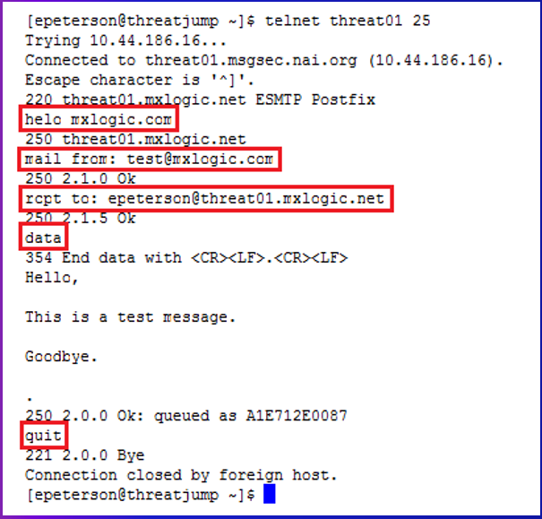

## Week 8 Write Up

### Messaging Security - Fundamentals
Messaging security is the practice of keeping messages encrypted so they are only seen by those that are intended, and keeps unwanted messages out.  Below is a list of fundamental terms and their descriptions.

* Spam: Electronic junk mail, junk newsgroup postings, or unsolicited email
* Spamtrap/Honeypot: Unprotected/Unfiltered computer isolated from other systems that collects spam and illegitimate spam
* Botnet: A series of machines that are running one or more bot to perform actions continously (Spam Bots).
* Snowshoe Spam: Strategy in which spam is propagated over several domains and IP addresses to weaken reputation metrics and avoid filters
* Phishing: Attacks on mass amount of user to obtain confidential information from users
* Spear Phishing: Specialized attacks against specific users to obtain confidential information
* RBL: Short for Realtime Blackhole List, a list of IP addresses whose owners refuse to stop the proliferation of spam.
* Heuristics: Filter that has the immediate goal in mind (inefficient)
* Bayesian (Statistical): Filter that is based on a corpus, a collection of data
* Fingerprinting/Hashing: Having a small amount of data that can track and represent a large amount of data

### Classic Spam messages
Spam messages starting in the 80's and 90's were usually following a classic format or technique.  One of these was 419 phishing messages.  419 is the criminal code that 419 phishing messages fall under.  This is the classic activity of claiming that you are someone else and asking for money or contact information from someone.  These came in not only email, but also physical mail.  419 phishing messages still occurs today and is effective because people are always looking for a "quick fix".

Another classic is the Candadian Pharmacy and these messages have spread more widely then any other spam campaign.  These messages usually come in the form of fake advertisements, but the content is all placed into span tags.  This is to avoid heuristic filters that are looking for key words within paragraph or header tags. An example is shown below.

This is the html content of the advertisement.

Pump 'N Dump are messages that are sent to artificially inflate prices of stock.  Spammers will send notifications to companies and stockholders convincing them to buy a certain stock.  As prices of the stock rises, Spammers will profit by quickly selling their inflated stock.

Botnets have been use to send these messages for a while, but they started getting noticed in 2009 when people began taking metrics.  Below is a graph showing botnet trends.

From the data you can tell that spam and botnets were huge in 2010, with the Rustock botnet dominating.  However, Rustock was not inconspicuous about their actions, and law enforcement cracked down on them.  From then on, the global spam market dropped until 2013, when a botnet called Kelihos began to rise in popularity.  Kelihos then drops off the face of the Earth in 2014.  What the graph doesn't show is that during declines, there is an increase of malicious messages that infect computer systems.  These viruses help give rise to the next wave of botnets.

### Defending Against Spam
Tools for defending against spam come in two forms, reputation-driven and content-driven tools.  Reputation-driven tools like IP addresses and URLs are used to try filter spam by looking at the history and source of messages.  Content-driven tools, such as common strings, message attributes, regular and meta expressions, try to filter spam by analyzing what is in a message.  Additional tools for research purposes are listed below.

* Linux Tools: Can investigate DNS records, search for IP registration information, and is capable of parsing data
* Open-source databases: Contains useful information and other tools
* The Regex Coach: Helps with expression syntax/functionality learning
* Trustedsource.org: Historical and current reputations based on McAfee data
* Spamhaus.org: Widely accepted as an authoritative source of repudataion data (Ecspecially in NA)

Here are list of resarch techniques:
* Parsing: Extraction of key metadata (information for other data)
* Grouping: Group messages by timestamp, source IP, cidr, subject, URL, etc.
* Aggregation: Categorize research paths in relation to value and time
* Identification of Outliers: When A, which is highly similar to B, is classified as spam but B is not. Why or why not?

### SMTP Conversations
SMTP Conversations can happen even over the most simplest messaging tools and typically happen on port 25.  When connected to the system the sender will have a banner displayed and a message.  The system reads the message and if they respond with a 200 class response, then the connection is approved.  If the response is a 400 class response that means there is a temporary failure and a 500 class response results in a complete failure.  After that the system asks who the recipient of the message is and gives a response.  If the recepient is approved, then the data phase of the conversation begins.  After the pahse is over, the system sends a response to approve the data. If data is approved, the system delivers or queues the message and quits.

An example of SMTP Conversations catching spam is shown below.  In it, a phrase in the data phase is seen as malicious.  So after the data phase, a 500 class response is given and the message isn't sent.

While there are some protections in place, the underlying layer of SMTP Conversations is vulnerable and can be manipulated.  For example, a user can alter the banner given so it looks like they are someone else and the message will still get approved (this is called spoofing).

### The Data Scientific Method
The point of data is to extract information, context, and value from it.  Below are steps to help analyze data.

1) Start with data.
2) Develop intuitions about the data and the questions it can answer.
3) Formulate your question.
4) Leverage your current data to better understand if it is the right question to ask.  If not, iterate until you have a testable hypothesis.
5) Create a framework where you can run tests/experiments.
6) Analyze the results to draw insights about the question.
