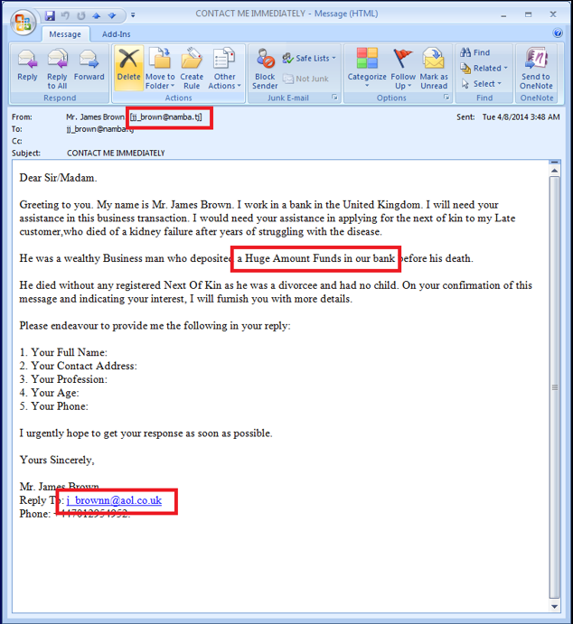

### Week 8 Write Up

## Messaging Security - Fundamentals
Messaging security is the practice of keeping messages encrypted so they are only seen by those that are intended, and keeps unwanted messages out.  Below is a list of fundamental terms and their descriptions.

* Spam: Electronic junk mail, junk newsgroup postings, or unsolicited email
* Spamtrap/Honeypot: Unprotected/Unfiltered computer isolated from other systems that collects spam and illegitimate spam
* Botnet: A series of machines that are running one or more bot to perform actions continously (Spam Bots).
* Snowshoe Spam: Strategy in which spam is propagated over several domains and IP addresses to weaken reputation metrics and avoid filters
* Phishing: Attacks on mass amount of user to obtain confidential information from users
* Spear Phishing: Specialized attacks against specific users to obtain confidential information
* RBL: Short for Realtime Blackhole List, a list of IP addresses whose owners refuse to stop the proliferation of spam.
* Heuristics: Filter that has the immediate goal in mind (inefficient)
* Bayesian (Statistical): Filter that is based on a corpus, a collection of data
* Fingerprinting/Hashing: Having a small amount of data that can track and represent a large amount of data

## Classic Spam messages
Spam messages starting in the 80's and 90's were usually following a classic format or technique.  One of these was 419 phishing messages.  419 is the criminal code that 419 phishing messages fall under.  This is the classic activity of claiming that you are someone else and asking for money or contact information from someone.  These came in not only email, but also physical mail.  419 phishing messages still occurs today and is effective because people are always looking for a "quick fix".

Another classic is the Candadian Pharmacy and these messages have spread more widely then any other spam campaign.  These messages usually come in the form of fake advertisements, but the content is all placed into span tags.  This is to avoid heuristic filters that are looking for key words within paragraph or header tags. An example is shown below.

This is the html content of the advertisement.

Pump 'N Dump are messages that are sent to artificially inflate prices of stock.  Spammers will send notifications to companies and stockholders convincing them to buy a certain stock.  As prices of the stock rises, Spammers will profit by quickly selling their inflated stock.

Botnets have been use to send these messages for a while, but they started getting noticed in 2009 when people began taking metrics.  Below is a graph showing botnet trends.

From the data you can tell that spam and botnets were huge in 2010, with the Rustock botnet dominating.  However, Rustock was not inconspicuous about their actions, and law enforcement cracked down on them.  From then on, the global spam market dropped until 2013, when a botnet called Kelihos began to rise in popularity.  Kelihos then drops off the face of the Earth in 2014.  What the graph doesn't show is that during declines, there is an increase of malicious messages that infect computer systems.  These viruses help give rise to the next wave of botnets.

