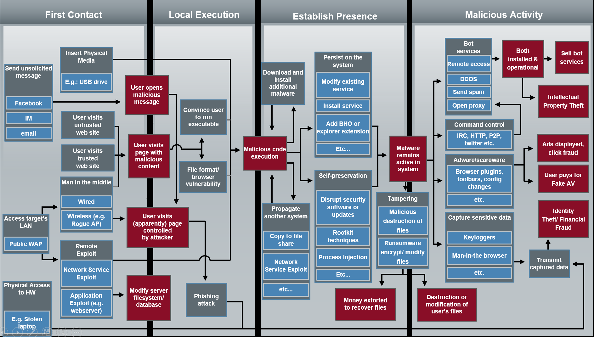
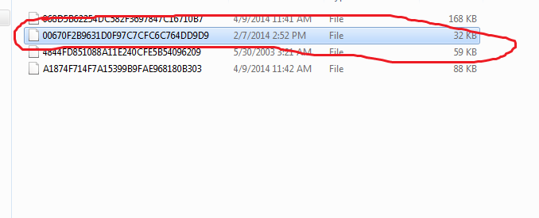
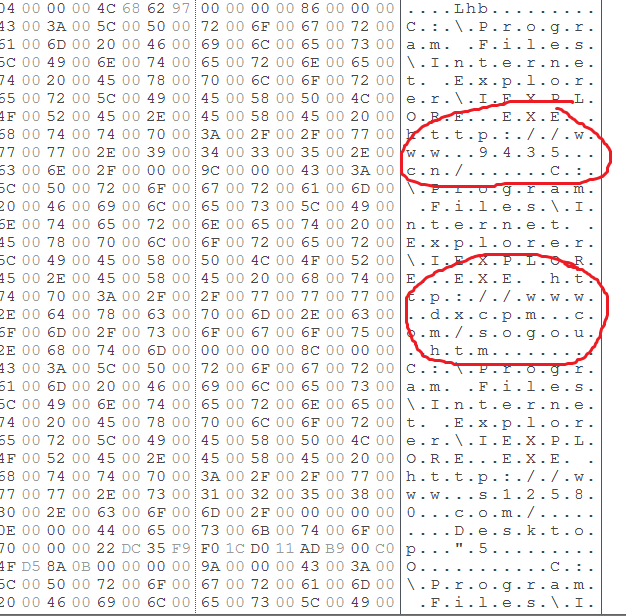
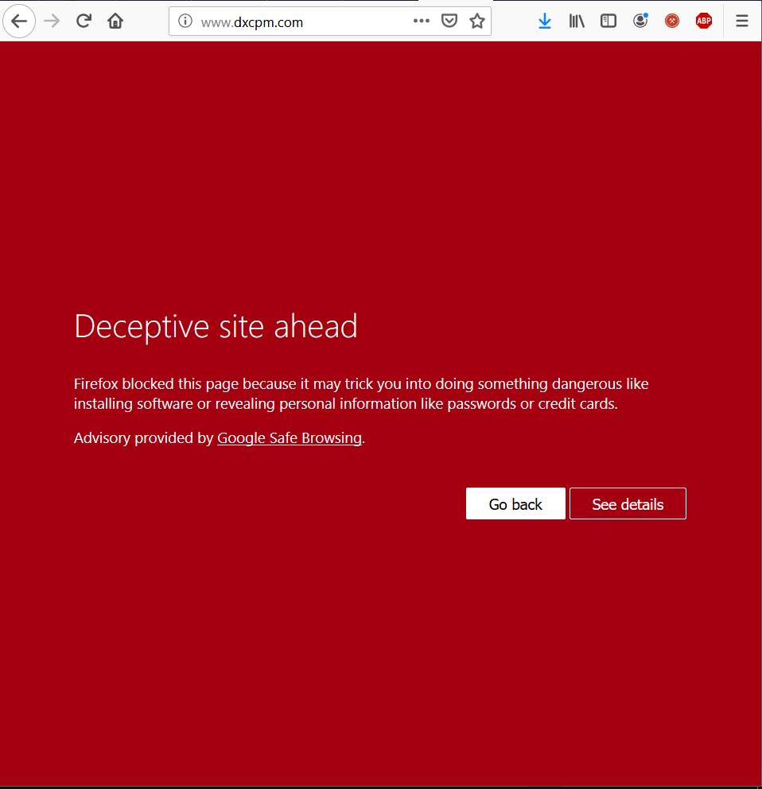
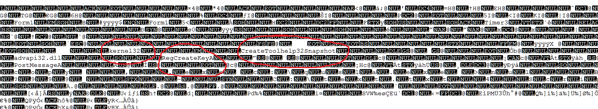
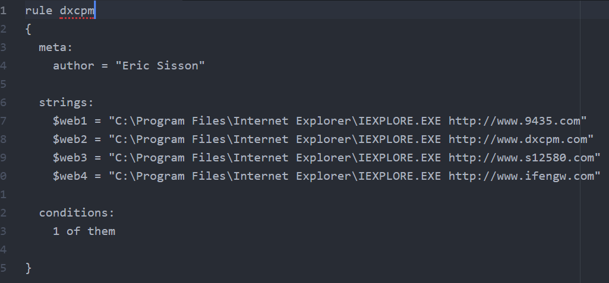

## Week 3 Write Up
### Introduction
The learning material for week 3 explains the general plan of attack for malware, and demonstrates how to defend against it.

## Attack Graph
Below is the plan of attack where malware attempts to follow four steps.  Malware first has to make contact and find its way onto a targeted system.  Then the malware finds away to execute its code once on the system.  After that, malware needs to establish a presence by finding a way to stay in the system.  Finally, the malware can start initiating malicious activity.

## Blog Post
Looking through the sample files, I can see that the second file is malware.  I found this by viewing the file through File Insight.

Through File Insight, I saw several website links that the file is trying to access several websites.

I then searched for the website www.dxcpm.com and my web browser blocked it, suggesting that the site is harmful.

 
There are also functions that point to how the malware works.  It can be seen editing memory (kernel132 handles memory management), accessing registries (RegCreateKeyA), and taking snapshots of information (CreateToolHelp32Snapshot).  From this I can conclude that the malware is looking at registry and memory information, and then using websites to transfer that information somewhere else.  Because of this, the yara signature has conditions containing the malicious websites.

For my yara rule, I just decided to flag any document that mentions any of the malicious sites written in the file.

